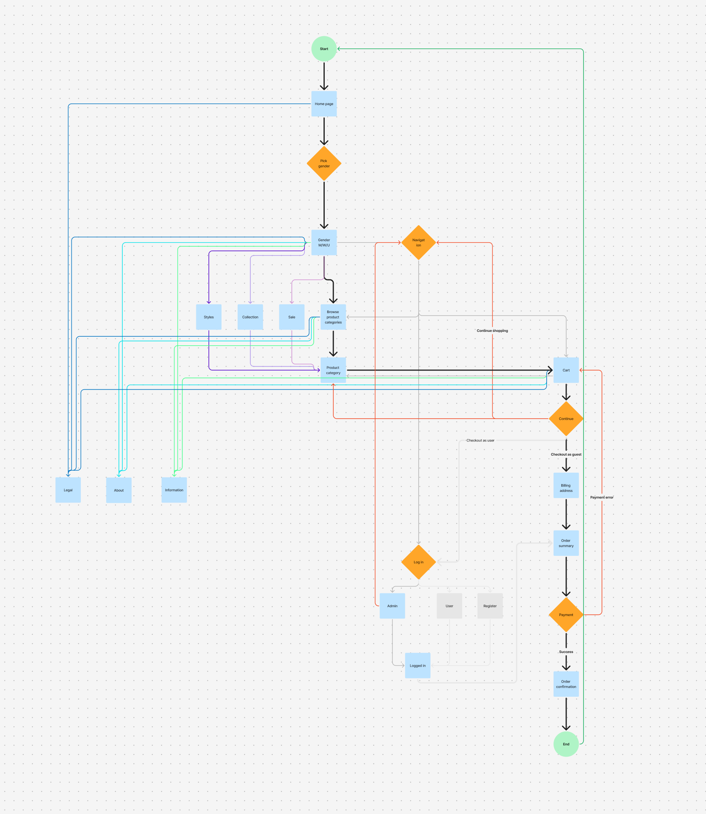
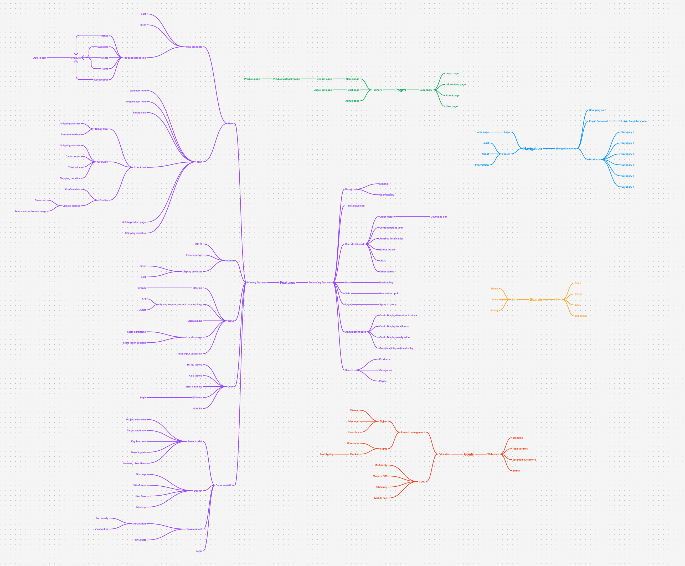
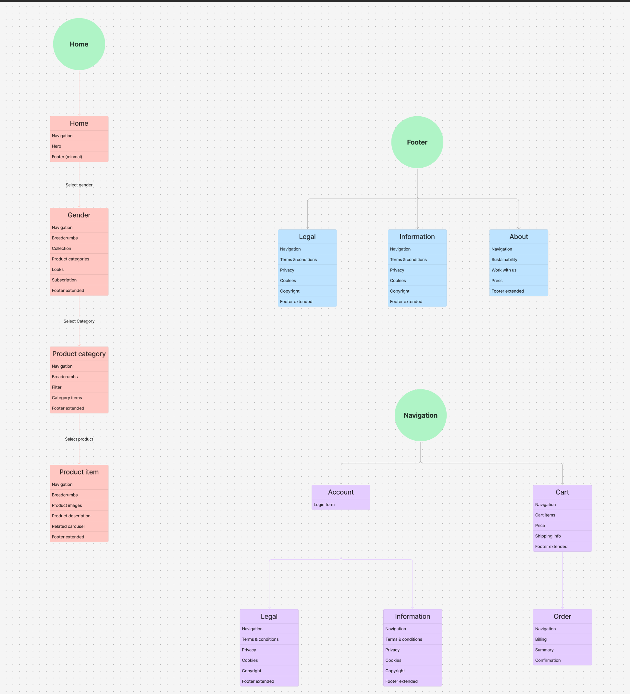
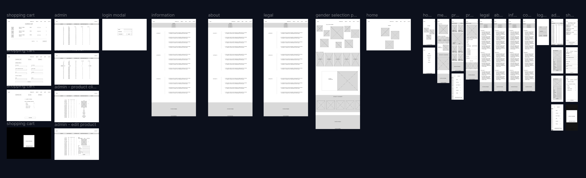
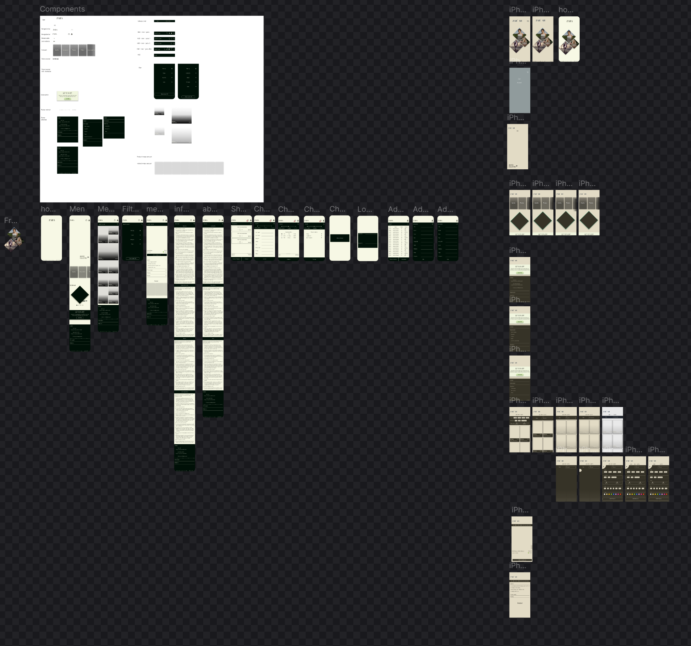

# Zorah
#### Webshop front-end rookie project

## Inhoud
- Beschrijving
- Features
- Geleerde vaardigheden
- Installatie
- Gebruik
- Project Management
- Licentie

## Beschrijving
Zorah is een e-commerce website gemaakt voor een schoolproject. Hiermee heb ik geprobeerd om geleerde vaardigheden in HTML, CSS en JavaScript toe te passen en uit te bereiden om de gebruiker een basale webshop te kunnen laten ervaren. Via de website kan een bezoeker producten browsen en bestellen terwijl een admin de te verschijnen producten kan bewerken middels een dashboard. De gebruikte en te genereren data werkt via de browsercache (local storage API) wat zorgt voor dynamische content generatie. 

## Features
- Product keuze uit verschillende categoriën en geslacht;
- Grotendeels dynamisch gegenereerde content;
- Navigatie naar andere pagina's;
- Producten aan winkelwagen toegevoegen;
- Producten in winkelwagen beheren;
- Producten bestellen;
- Gebruikers' keuzes opslaan in local storage;
- Log in modal met toegang tot admin dashboard;
- Admin dashboard producten data beheer inclusief filter;
- Toevoegen van producten door admin;
- Inzien bestellingen door admin inclusief filter;

## Geleerde vaardigheden
- Schaalbaar
  - Werken met componenten;
  - Dynamisch content genereren;
- Design
  - Basis vaardigheden Figma;
  - Opzet / user flow web shops
- Project Management
  - Planning d.m.v. mindmaps, userflows, wireframes en mockups;
- Clean code
  - Functies klein en specifiek houden;
  - Bestanden logisch organiseren;
  - Filteren van- en zoeken naar data kort houden;
  - Rekening houden met foutmeldingen;
  - Werken met ESlint;

## Installatie
- Draai op lokale webserver
  A) Clone de repository met het commando: git clone https://github.com/sybrenkeizer/bit-rookie-webshop-project.git;
  B) Navigeer naar de project directory: cd bit-rookie-webshop-project;
  C) Start lokale webserver op poort 8000 met php: php -S localhost:8000;
  D) Bekijk de website op een browser naar keuze via: http://localhost:8000/index.html;
- Bekijk online
  - De webshop is gehost op GitHub Pages en kan direct in de browser worden bekeken via:
  https://sybrenkeizer.github.io/bit-rookie-webshop-project/index.html;

## Gebruik
- Start pagina: De bezoeker kan een keuze maken naar gender;
- Gender pagina: De bezoeker kan een categorie kiezen voor kleding in het gekozen geslacht;
- Catalogus pagina: hier verschijnen alle producten in de gekozen categorie binnen het gekozen gender, een klik op het product brengt de bezoeker naar de product pagina;
- Product pagina: informatie over het gekozen product kan worden bekeken en het product kan aan de winkelwagen worden toegevoegd;
- Winkelmandje: Als de winkelwagen niet leeg is kan hier, vanuit alle pagina's behalve de start- en dashboard pagina, naar toe worden genavigeerd. Hier kan het aantal van het product worden vergroot en verkleint of het product kan worden verwijderd. De gebruiker kan besluiten om verder te winkelen of af te rekenen;
- Dashboard pagina: Vanuit alle pagina's behalve de start pagina kan de bezoeker inloggen als admin - andere gebruikers worden niet ondersteund. De admin inloggegevens zijn: username = "admin" met password = "admin". Op het dashboard kunnen producten worden overzien, gefilterd, aangepast en verwijderd. Orders kunnen via een tabblad ook worden bekeken en gefilterd;
- Navigatie: De top header geeft op de meeste pagina's een indicatie waar de gebruiker zich momenteel bevind (breadcrumbs). Hier bevind zich ook een knop om naar de bovenstaande pagina te navigeren. 
- Footer: Onderaan de meeste pagina's is een footer geplaatst. Deze komt in twee varianten, een smalle footer met links naar essentiële informatie voor de gebruiker, als wel een uitgebreide footer met contact details en links naar handige, maar niet noodzakelijke, informatie waar de gebruiker gemakkelijk naar navigeren kan. De links zijn vooralsnog inactief.

## Project management
- User flow:

- Mind map: 

- Site map: 

- Wireframe:

- Mockup:

## Licentie
Dit project is gelicenseerd onder de MIT-licentie. 
- De MIT-licentie staat iedereen toe om de code te gebruiken, te kopiëren, te modificeren en te distribueren, zolang de oorspronkelijke auteurs en de licentie-informatie in alle kopieën of substantiële delen van de software worden vermeld.
- De volledige licentie is te vinden in het bestand LICENSE.txt in dit project.